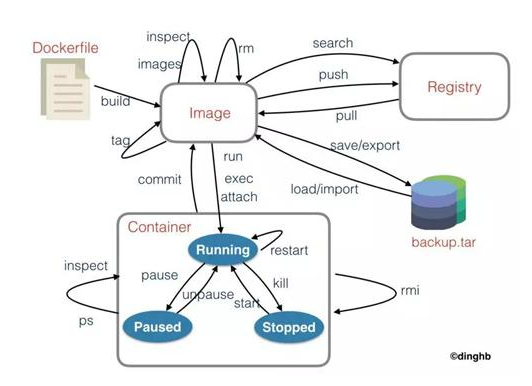

# Docker入门知识

Docker 到底是个什么东西呢?我们在理解 Docker 之前，首先得先区分清楚两个概念，容器和虚拟机

传统虚拟机如 VMware ， VisualBox 之类的需要模拟整台机器包括硬件。每台虚拟机都需要有自己的操作系统，虚拟机一旦被开启，预分配给它的资源将全部被占用。每一台虚拟机包括应用，必要的二进制和库，以及一个完整的用户操作系统。  

容器技术是和我们的宿主机共享硬件资源及操作系统，可以实现资源的动态分配。

容器包含应用和其所有的依赖包，但是与其他容器共享内核。容器在宿主机操作系统中，在用户空间以分离的进程运行。

容器技术是实现操作系统虚拟化的一种途径，可以让您在资源受到隔离的进程中运行应用程序及其依赖关系。通过使用容器，我们可以轻松打包应用程序的代码、配置和依赖关系，将其变成容易使用的构建块，从而实现环境一致性、运营效率、开发人员生产力和版本控制等诸多目标。  

---

### Docker 的三个基本概念

1. Image(镜像)
2. Container(容器)
3. Repository(仓库)

镜像是 Docker 运行容器的前提，仓库是存放镜像的场所，可见镜像更是 Docker 的核心。

##### Image(镜像)

那么镜像到底是什么呢?Docker 镜像可以看作是一个特殊的文件系统，除了提供容器运行时所需的程序、库、资源、配置等文件外，还包含了一些为运行时准备的一些配置参数(如匿名卷、环境变量、用户等)。

镜像不包含任何动态数据，其内容在构建之后也不会被改变。镜像(Image)就是一堆只读层(read-only layer)的统一视角。

统一文件系统(Union File System)技术能够将不同的层整合成一个文件系统，为这些层提供了一个统一的视角。

这样就隐藏了多层的存在，在用户的角度看来，只存在一个文件系统。

##### Container(容器)

容器(Container)的定义和镜像(Image)几乎一模一样，也是一堆层的统一视角，唯一区别在于容器的最上面那一层是可读可写的。

由于容器的定义并没有提及是否要运行容器，所以实际上，容器 = 镜像 + 读写层。

##### Repository(仓库)

Docker 仓库是集中存放镜像文件的场所。镜像构建完成后，可以很容易的在当前宿主上运行。

有时候会把仓库(Repository)和仓库注册服务器(Registry)混为一谈，并不严格区分。

Docker 仓库的概念跟 Git 类似，注册服务器可以理解为 GitHub 这样的托管服务。

实际上，一个 Docker Registry 中可以包含多个仓库(Repository)，每个仓库可以包含多个标签(Tag)，每个标签对应着一个镜像。

所以说，镜像仓库是 Docker 用来集中存放镜像文件的地方，类似于我们之前常用的代码仓库。

通常，一个仓库会包含同一个软件不同版本的镜像，而标签就常用于对应该软件的各个版本 。

我们可以通过<仓库名>:<标签>的格式来指定具体是这个软件哪个版本的镜像。如果不给出标签，将以 Latest 作为默认标签。

----

当用户创建了自己的镜像之后就可以使用 Push 命令将它上传到公有或者私有仓库，这样下次在另外一台机器上使用这个镜像时候，只需要从仓库上 Pull 下来就可以了。

---

Docker 分为 CE 和 EE 两大版本。CE 即社区版，免费支持周期 7 个月;EE 即企业版，强调安全，付费使用，支持周期 24 个月

---

Docker 容器就是 Docker 镜像的运行实例，是真正运行项目程序、消耗系统资源、提供服务的地方。