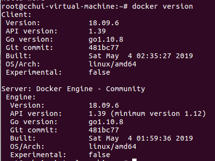

# Docker安装（Ubuntu版）

### 1.Ubuntu中安装Docker的方式

docker在Ubuntu上的安装有两种方式：

>一种是Ubuntu维护的版本
>
>一种是Docker自己维护的版本

---

Ubuntu维护的版本

```
sudo apt-get install docker.io
source /etc/bash_completion.d/docker.io
```

一般，Ubuntu版本的docker版本比较低。

-----

Docker自己维护的版本

```
1.检查APT的HTTPS 支持 查看/usr/lib/apt/methods/https文件是否存在如果不存在，运行安装命令
apt-get update
apt-get install -y apt-transport-https

2.添加Docker的APT仓库
echo deb https://get.docker.com/ubuntu docker main>/etc/apt/sources.list.d/docker.list

3.添加仓库的KEY
apt-key adv --keyserver hkp://keyserver.ubuntu.com:80--recv-keys
36A1d7869245C8950F966E92D8576A8BA88D21E9

4.安装
apt-get update
apt-get install -y lxc-docker
```
另一种简单的安装

```
sudo apt-get install -y curl
curl -sSL https://get.docker.com/ | sh 
```

### 2.查看Docker版本

查看docker版本

```
docker version
```



测试让容器输出hello Word

```
docker run ubuntu echo "hello world"
```

### 3.使用 非root 用户

```
sudo groupadd docker
sudo gpasswd -a${USER}docker
sudo service docker restart
```

### 4.Docker-compose的安装

安装：

```
sudo curl -L https://github.com/docker/compose/releases/download/1.21.2/docker-compose-$(uname -s)-$(uname -m) -o /usr/local/bin/docker-compose
sudo chmod +x /usr/local/bin/docker-compose
```

如果安装速度较慢，可以换一个网址：

```
curl -L https://get.daocloud.io/docker/compose/releases/download/1.24.0/docker-compose-`uname -s`-`uname -m` > /usr/local/bin/docker-compose
```

查看版本：

```
docker-compose -v
```

