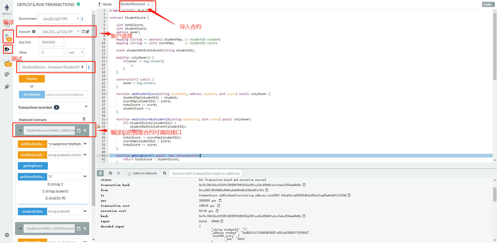
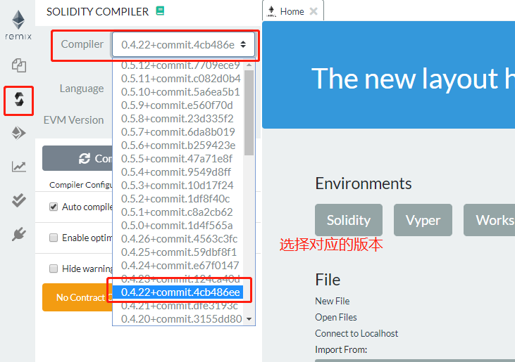
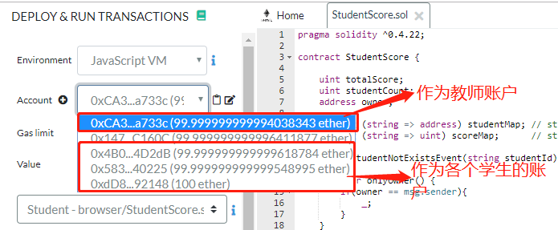
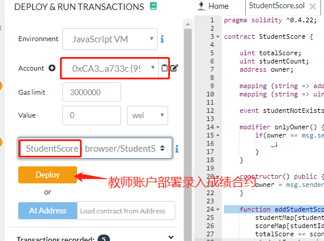
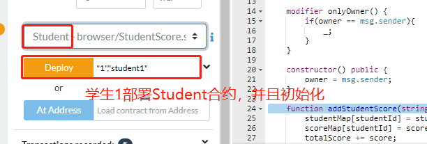
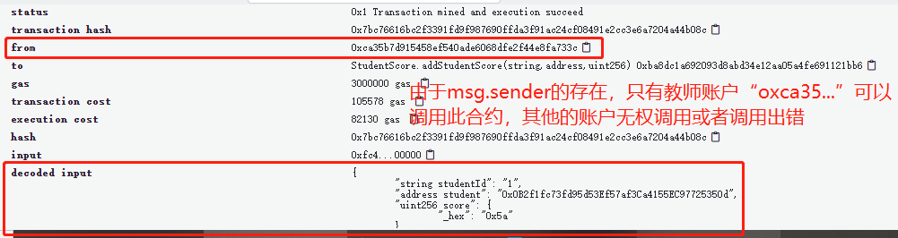
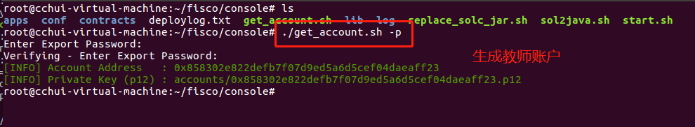
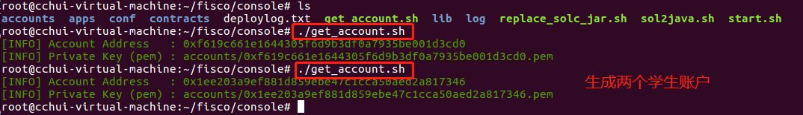
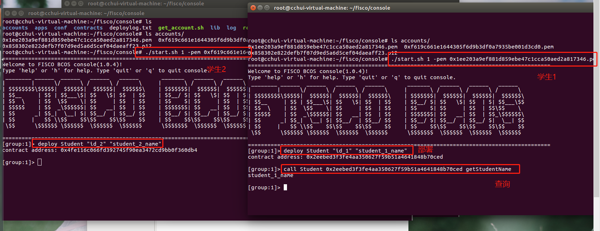
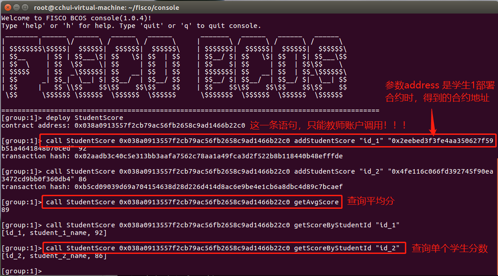

# 区块链上的智能合约

## 实验介绍

通过这次实验理解智能合约在区块链中的作用，学会智能合约的编写、测试、调试和部署，掌握`Solidity`语言的特性，最后编写一个具有简单功能的合约，在区块链平台（`FISCO BCOS`）上完成部署和调用。

## 能学习到什么

- `Solidity`语言，智能合约的开发方法
- 学习如何使用`Remix`调试智能合约
- 学习如何在`FISCO BCOS`上部署、调用智能合约
- 进一步理解联盟链上的账户概念
- 使用`SDK`进行区块链的应用开发，详细文档请参考[FISCO BCOS官方文档](https://fisco-bcos-documentation.readthedocs.io/zh_CN/latest/docs/sdk/java_sdk.html) 

## 环境准备

- 实验四搭建的`FISCO BCOS`底层平台和控制台（有区块链浏览器，效果更佳）

- [Remix]( https://remix.ethereum.org/ )智能合约在线调试工具

## 知识准备

- 学习Solidity

  - [**Solidity入门知识点集**](https://segmentfault.com/a/1190000019208534#articleHeader29)
  - [**官方文档(中文)**](https://solidity-cn.readthedocs.io/zh/develop/)
  - [**FISCO BCOS 智能合约开发**](https://fisco-bcos-documentation.readthedocs.io/zh_CN/latest/docs/manual/smart_contract.html)
  - [**智能合约在线编辑器Remix**](https://remix.ethereum.org/ )

- 学习[Remix](https://remix.ethereum.org/ )
- 学习[示例合约](./contract case)
  - `Hello`合约用于普及合约样式，合约结构、以及编译之后合约的运行原理
  - `Lesson`合约主要用户讲解合约数据类型、函数、关键字、账户、常用加密方法等使用方法
  - `Base`合约用户介绍合约的继承及抽象合约的使用

- [`实验用到的Solidity特性说明.md`](./实验用到的Solidity特性说明.md)

## 实验步骤

### 第一步 编写智能合约

**现在有下面场景的区块链应用：**

学期末课程结束后，老师需要录入学生的课程成绩信息，通过智能合约，存储在区块链上。

每个学生分别部署合约`Student.sol` ，保证只有自己可以修改姓名。老师部署合约`StudentScore.sol`，用于录入学生成绩，查询学生信息。查询学生信息时，需要调用学生部署的合约`Student.sol`。

**msg.sender说明：**

```tsx
// 表示当前部署合约的账户地址
msg.sender    

// 判断账户地址，控制访问权限
modifier onlyOwner() {
        if(owner == msg.sender){
            _;
        }
    }
```

**`Student.sol`合约，用于学生信息初始化**

```tsx
contract Student {
    string studentId;   //学生的id
    string studentName; //学生姓名
    address owner;
    //这一步很重要，希望可以好好理解其中的意思
    modifier onlyOwner() {
        if(owner == msg.sender){
            _;
        }
    }
    //构造函数
    constructor(string _studentId, string _stdentName) public {
        studentId = _studentId;
        studentName = _stdentName;
        owner = msg.sender;
    }
    ......
}
```

**修改姓名：**

```
function getStudentName() public constant returns(string) {
    return studentName;
}
//查询姓名
function setStudentName(string _studentName) public onlyOwner {
     studentName = _studentName;
}
```

**`StudentScore.sol`合约，用于录入、查询学生成绩**

```tsx
contract StudentScore {
    uint totalScore;      //全班总成绩
    uint studentCount;    //统计学生数量
    address owner;        //部署合约的账户地址
    //map映射，根据学生ID，存储学生的address和成绩
    mapping (string => address) studentMap; // studentId->student
    mapping (string => uint) scoreMap;      // studentId->score
    //事件
    event studentNotExistsEvent(string studentId);
    //这个用于后面的权限判断，只有部署这个合约的用户，才能调用带有onlyOwner修饰符的方法
    //" _; "一定要添加，它表示使用修改符的函数体的替换位置
    modifier onlyOwner() {
        if(owner == msg.sender){
            _;
        }
    }
    //构造函数
    constructor() public {
        owner = msg.sender;
    }
	...... 
}
```

**添加学生成绩：**

```
//onlyOwner 是自定义的函数修饰符，这里表示：只有本合约部署人，才能访问本函数
function addStudentScore(string studentId, address student, uint score) public onlyOwner {
        studentMap[studentId] = student;  //使用到了map映射   
        scoreMap[studentId] = score;
        totalScore += score;
        studentCount ++;
}
//修改成绩    
function modifyScoreByStudentId(string studentId, uint score) public onlyOwner{
    ......
}
```

**查询学生成绩：**

```
//constant是函数修饰符，告诉编译器，函数不改变/不读取状态变量。没有这个变量，在将来SDK调用时，无法获取
//到返回值。之后的实验，同学们可以自行体会
function getScoreByStudentId(string studentId) public constant returns(string, string, uint){
	......
}
```

**判断学生是否存在：**

```
function studentExists(string studentId) public view returns(bool){
	......
}
```

### 第二步 调试

在`Remix`上调试智能合约，调试网址为：https://remix.ethereum.org/ 

编译器功能如图：



进入编译器后，**选择对应的智能合约版本**

```tsx
pragma solidity ^0.4.22;      //加了 ^ 之后，表示版本在0.4.22~0.5之间
```



进入测试页面后，有5个账户可供选择：



选择教师账户,部署`StudentScore.sol`：



选择学生账户，部署`Student.sol`：



之后，可测试智能合约：


添加学生成绩后，可以查看到交易回执：



### 第三步 在`FISCO BCOS` 上部署调用

首先，使用脚本`get_account.sh`生成教师和学生这两个角色账户，具体生成方法，请参考[文档](https://fisco-bcos-documentation.readthedocs.io/zh_CN/latest/docs/manual/account.html)

```tsx
Usage: ./get_account.sh
    default       generate account and store private key in PEM format file
    -p            generate account and store private key in PKCS12 format file
    -k [FILE]     calculate address of PEM format [FILE]
    -P [FILE]     calculate address of PKCS12 format [FILE]
    -h Help
```

生成一个教师账户：



生成两个学生账户：



**分别开三个终端，以`教师`和`学生`的身份登录控制台：**

控制台启动方式有如下几种：

```
./start.sh
./start.sh groupID
./start.sh groupID -pem pemName
./start.sh groupID -p12 p12Name
```

使用`教师` 的私钥，启动一个终端，登录控制台，记为`终端1`。 

部署`StudentScore.sol`:


同理，在另外两个端口，分别以学生身份登录控制台，记为`终端2`和`终端3`

部署`Student.sol`合约：



切换回`终端1`，

根据部署的`Student.sol`智能合约地址，录入两个学生的成绩：



至此，完整的调用流程结束。感兴趣的同学，可以多试试生成多个学生用户，多机部署，分布式调用。

有条件的话，可以在区块链浏览器上查询结果
