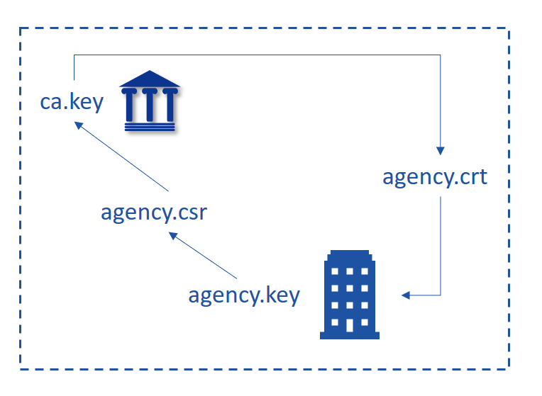
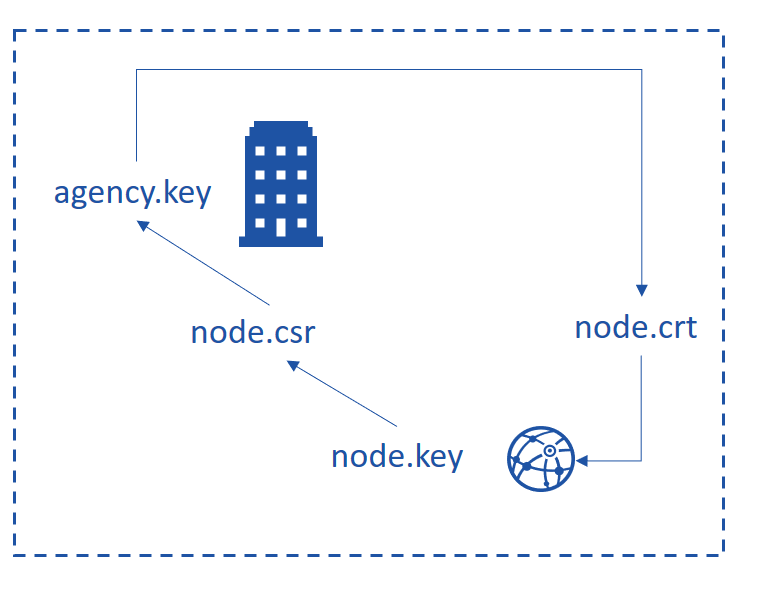
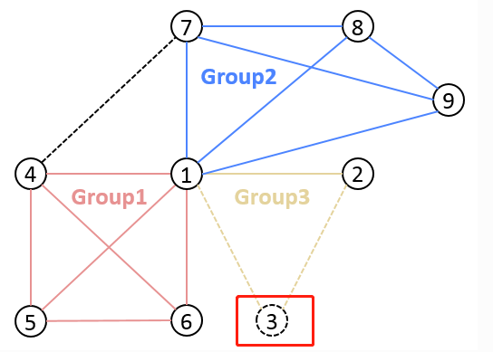

# FISCO BCOS的证书体系

### Part 1：FISCO BCOS 证书结构

FISCO BCOS 使用 `x509协议的证书格式`，根据现有业务场景，默认采用三级的证书结构，自上而下分别为链证书、机构证书、节点证书。

一条链拥有一个链证书及对应的链私钥，链私钥由链管理员拥有。并对每个参与该链的机构签发机构证书，机构证书私钥由机构管理员持有，并对机构下属节点签发节点证书。节点证书是节点身份的凭证，并使用该证书与其他节点间建立 `SSL`连接进行加密通讯。`sdk`证书是`sdk`与节点通信的凭证（即，客户端和节点交互的客户端证书），机构生成 `sdk`证书，允许`sdk`与节点进行通信。

证书内容包括了证书版本号、序列号、证书的签名算法、消息摘要算法等生成信息；同时包括了证书的颁发者、有效期、使用者、公钥信息、`SSL`通信需要用到的密码套件等信息。


节点通过加载证书，在接受数据包时，根据证书规定的密码套件和其消息字段，对数据包中携带的证书进行验证。

---

### Part 2：角色定义

`FISCO BCOS`的证书结构中有４种角色，分别是联盟链委员会、联盟链成员机构、联盟链参与方（节点和`SDK`）。

#### 1. 联盟链委员会

联盟链委员会拥有联盟链的根证书`ca.crt`和私钥`ca.key`，通过使用`ca.key`对联盟链成员机构签发机构证书，负责完成联盟链成员机构的准入、剔除等操作。

#### 2. 联盟链成员机构

联盟链成员机构为经过联盟链委员会许可，加入到联盟链的机构。联盟链成员机构拥有机构私钥`agency.key`和经过根私钥`ca.key`签发的机构证书`agency.crt`。联盟链成员机构可以通过机构私钥签发节点证书，从而配置本机构的节点和`SDK`。

#### 3. 联盟链参与方

联盟链参与方可以通过运行节点或`SDK`联盟链交互，拥有与其他节点进行通信的节点证书`node.crt`和私钥`node.key`。联盟链参与方运行节点或`SDK`时，需要加载根证书`ca.crt`和相应的节点证书`node.crt`和私钥`node.key`；与其他成员进行网络通信时，使用预先加载的证书进行身份认证。

---

### Part 3：证书生成流程

##### 1. 联盟链委员会初始化根证书 ca.crt

- 本地利用 openssl命令生成私钥 `ca.key`；


- 自签生成根证书 `ca.crt`。

##### 2. 联盟链成员机构获取机构证书 agency.crt

- 本地利用 openssl命令生成私钥 `agency.key`；
- 由本地私钥生成证书请求文件 `agency.csr`；
- 将证书请求文件 `agency.csr` 发送至联盟链委员会；
- 联盟链委员会使用 `ca.key`对证书请求文件 `agency.csr`进行签发，得到联盟链成员机构证书 `agency.crt`；
- 联盟链委员会将联盟链成员机构证书`agency.crt`发送至对应成员。



##### 3. 节点/SDK获取证书 node.crt

- 本地利用 openssl命令生成私钥 node.key；
- 由本地私钥生成证书请求文件 `node.csr`；
- 将证书请求文件`node.csr`发送至联盟链成员机构；
- 联盟链成员机构使用`agency.key`对证书请求文件`node.csr`进行签发，得到节点/SDK证书`node.crt`；
- 联盟链成员机构将节点证书 node.crt 发送至对应实体。



---

### Part 4：证书生成实例

以生成联盟链成员机构机构证书为例：

1.机构首先在本地使用机构私钥 agency.key 生成证书请求文件 `agency.csr`；

```
openssl req -new -sha256 -subj "/CN=$name/O=fisco-bcos/OU=agency" -key ./agency.key -config ./cert.cnf -out ./agency.csr
```

2.联盟链委员会根据证书请求文件生成机构证书 agency.crt；

```
openssl x509 -req -days 3650 -sha256 -CA ./ca.crt -CAkey ./ca.key -CAcreateserial -in ./agency.csr -out ./agency.crt  -extensions v4_req -extfile ./cert.cnf
```

上述过程中的 `cert.cnf`为证书信息配置项，可以采用默认设置。

---

### Part 5： 证书验证

以三级证书为例，讲解证书的验证过程。 `TLS` 握手中的证书验证，即通过加载双方预先都信任的根证书，从而认证对方的身份。


在程序启动时，会首先加载本地的 ca.crt 和 node.crt；

当节点验证对方的证书时，会首先使用对方 node.crt 中的公钥验证附带的签名，当验证通过时，可以确认对应节点拥有当前 node.crt 对应的 node.key；

之后节点会使用 agency.crt 中的信息验证 node.crt 是否为合法的 agency签发；

最后节点会使用本地加载 ca.crt 中的信息验证 agency.crt 是否为联盟链委员会签发；

当两者都验证通过时，表示节点接收到的node.crt是由本地加载的ca.crt签发的。

---

### Part 6：新节点入网过程中证书的使用

节点3 原先不在网络中，现在加入网络。



1 . 进入 nodes 同级目录，在该目录下拉取并执行`gen_node_cert.sh`生成节点目录，目录名以node2为例，node2内有`conf/`目录；

```
# 获取脚本
$ curl -LO https://raw.githubusercontent.com/FISCO-BCOS/FISCO-BCOS/master/tools/gen_node_cert.sh && chmod u+x gen_node_cert.sh
# 执行，-c为生成节点所提供的ca路径，agency为机构名，-o为将生成的节点目录名
$ ./gen_node_cert.sh -c nodes/cert/agency -o node2
```

***`gen_node_cert.sh`脚本会一键生成所需要的证书***

2 . 拷贝node2到`nodes/127.0.0.1/`下，与其他节点目录（`node0`、`node1`）同级；

3 . 进入`nodes/127.0.0.1/`，拷贝`node0/config.ini`、`node0/start.sh`和`node0/stop.sh`到node2目录;

4 . 修改`node2/config.ini`。对于`[rpc]`模块，修改`listen_ip`、`channel_listen_port`和`jsonrpc_listen_port`；对于`[p2p]`模块，修改`listen_port`并在`node.`中增加自身节点信息；

```
$ vim node2/config.ini
[rpc]
    ;rpc listen ip
    listen_ip=127.0.0.1
    ;channelserver listen port
    channel_listen_port=20302
    ;jsonrpc listen port
    jsonrpc_listen_port=8647
[p2p]
    ;p2p listen ip
    listen_ip=0.0.0.0
    ;p2p listen port
    listen_port=30402
    ;nodes to connect
    node.0=127.0.0.1:30400
    node.1=127.0.0.1:30401
    node.2=127.0.0.1:30402
```

5 . 节点3拷贝节点1的`node1/conf/group.3.genesis`（内含**群组节点初始列表**）和`node1/conf/group.3.ini`到`node2/conf`目录下，不需改动；

6 . 执行`node2/start.sh`启动节点3；

```
$ ./node2/start.sh
```

7 . 确认节点3与节点1和节点2的连接已经建立，加入网络操作完成。

---

### Part 7：证书在其他方面的使用


说明：

SSL 认证用于确定节点之间是否许可加入某条链。一条链上的节点均信任可信的第三方（节点证书的颁发者）。

FISCO BCOS 要求实现**SSL 双向认证**。节点在handshake过程中，从对方节点提供的证书中获取对方节点的nodeID，检查该 nodeID 是否在自身的CA黑名单。如存在，关闭该connection，如不在，建立session。

##### 一般初始化流程：


