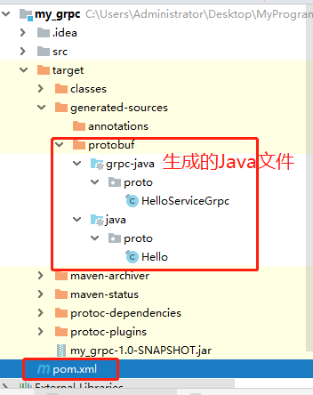

# gRPC系列之Java端的使用（1）

### 1.Proto文件定义

使用 protocol buffers 接口定义语言来定义服务方法，用 protocol buffer 来定义参数和返回类型。客户端和服务端均使用服务定义生成的接口代码。

实现一个sayHello方法,`proto`文件编写如下：

```
syntax = "proto3";

package proto;

service HelloService {
    rpc SayHello (HelloRequest) returns (HelloResponse);
}
  
message HelloRequest {
    string greeting = 1;
}
  
message HelloResponse {
    string reply = 1;
}
```

###  2. gRPC-JAVA的环境配置

参照https://github.com/grpc/grpc-java 步骤进行配置：

#### 1.添加依赖：

```
<dependency>
  <groupId>io.grpc</groupId>
  <artifactId>grpc-netty-shaded</artifactId>
  <version>1.24.0</version>
</dependency>
<dependency>
  <groupId>io.grpc</groupId>
  <artifactId>grpc-protobuf</artifactId>
  <version>1.24.0</version>
</dependency>
<dependency>
  <groupId>io.grpc</groupId>
  <artifactId>grpc-stub</artifactId>
  <version>1.24.0</version>
</dependency>
```

#### 2.添加插件：

```
<build>
  <extensions>
    <extension>
      <groupId>kr.motd.maven</groupId>
      <artifactId>os-maven-plugin</artifactId>
      <version>1.6.2</version>
    </extension>
  </extensions>
  <plugins>
    <plugin>
      <groupId>org.xolstice.maven.plugins</groupId>
      <artifactId>protobuf-maven-plugin</artifactId>
      <version>0.6.1</version>
      <configuration>
        <protocArtifact>com.google.protobuf:protoc:3.10.0:exe:${os.detected.classifier}</protocArtifact>
        <pluginId>grpc-java</pluginId>
        <pluginArtifact>io.grpc:protoc-gen-grpc-java:1.24.0:exe:${os.detected.classifier}</pluginArtifact>
      </configuration>
      <executions>
        <execution>
          <goals>
            <goal>compile</goal>
            <goal>compile-custom</goal>
          </goals>
        </execution>
      </executions>
    </plugin>
  </plugins>
</build>
```

完整的`pom.xml`文件是这样的： https://github.com/grpc/grpc-java/blob/master/examples/pom.xml 

#### 3. 编译成java文件

按照这个官方文档的说明， 需要把之前创建的`helloworld.proto`放到项目里，不能随便放，有默认位置，在`src/main/`下新建`proto`文件夹，并把`helloworld.proto`放进去。 

在控制台输入` mvn compile`。会在`target`下生产一堆文件，在`target/generated-sources/protobuf/java` 和`grpc-java`下会生成我们需要的文件 ，如图所示：



### 3. 编写Java的服务端和客户端

参考[官方文档](https://github.com/grpc/grpc-java)，编写其客户端和服务端，用于测试。

#### 1.gRPC-Java的服务端

首先创建一个服务端处理消息的类，实现我们服务定义的生成的服务接口，做我们的服务的实际的“工作”。

```
    static class GreeterImpl extends HelloServiceGrpc.HelloServiceImplBase {
        @Override
        public void sayHello(Hello.HelloRequest request, StreamObserver<Hello.HelloResponse> responseObserver) {
//            这个super.sayHello()如果不注释掉的话，会一直提示说，方法没有实现
//            super.sayHello(request, responseObserver);
            Hello.HelloResponse helloResponse = Hello.HelloResponse.newBuilder().setReply("hello "+request.getGreeting()).build();
            responseObserver.onNext(helloResponse);
            responseObserver.onCompleted();
        }

    }
```

这里注意一个很坑的地方，就是在继承父类的时候，使用快捷键`ctrl+o`，实现父类方法时，会带有`super.sayHello(request, responseObserver);`

**注意，要把这个注释掉，不然客户端会报错，说没有实现父类的方法。**

### 2.gRPC-Java的客户端

客户端的实现：

```
    /** Say hello to server. */
    public void greet(String name) {
        logger.info("Will try to greet " + name + " ...");


        Hello.HelloRequest request = Hello.HelloRequest.newBuilder().setGreeting(name).build();
        Hello.HelloResponse response;
        try {
            response = blockingStub.sayHello(request);
        } catch (StatusRuntimeException e) {
            logger.log(Level.WARNING, "RPC failed: {0}", e.getStatus());
            return;
        }
        logger.info("Greeting: " + response.getReply());
    }

```

