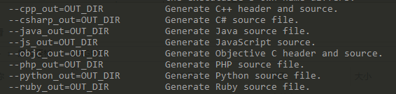

# gRPC系列之Protobuf的安装和使用

Protobuf是Protocol Buffers的简称，它是Google公司开发的一种数据描述语言，并于2008年对外开源。Protobuf刚开源时的定位类似于XML、JSON等数据描述语言，通过附带工具生成代码并实现将结构化数据序列化的功能。但是我们更关注的是Protobuf作为接口规范的描述语言，可以作为设计安全的跨语言PRC接口的基础工具。

### 1.安装Protocol Buffers

#### 1.1 Ubuntu下，源码安装

从`github`上下载自己想要的版本，建议下载`all`版本 ，我下载的是protobuf-all-3.10.0.zip包 

下载好后，解压，切换到对应根目录下，编译安装：

```
protobuf默认安装在 /usr/local 目录
你可以修改安装目录通过 ./configure --prefix=命令
虽然我是root用户但觉得默认安装过于分散，所以统一安装在/usr/local/protobuf下

$./configure --prefix=/usr/local/protobuf
$ make             //编译未编译的依赖包  #要编译很久
$ make check       //检查依赖包是否完整
$ make install     //开始安装Protocol Buffer
```

添加到系统的环境变量中：

```
vim  /etc/profile
```

打开配置文件，在该文件中添加下面内容，配置环境变量：

```
####### add protobuf lib path ########
#(动态库搜索路径) 程序加载运行期间查找动态链接库时指定除了系统默认路径之外的其他路径
export LD_LIBRARY_PATH=$LD_LIBRARY_PATH:/usr/local/protobuf/lib/
#(静态库搜索路径) 程序编译期间查找动态链接库时指定查找共享库的路径
export LIBRARY_PATH=$LIBRARY_PATH:/usr/local/protobuf/lib/
#执行程序搜索路径
export PATH=$PATH:/usr/local/protobuf/bin/
#c程序头文件搜索路径
export C_INCLUDE_PATH=$C_INCLUDE_PATH:/usr/local/protobuf/include/
#c++程序头文件搜索路径
export CPLUS_INCLUDE_PATH=$CPLUS_INCLUDE_PATH:/usr/local/protobuf/include/
#pkg-config 路径
export PKG_CONFIG_PATH=/usr/local/protobuf/lib/pkgconfig/
######################################
```


然后保存退出，执行：
```
source /etc/profile
```

检查 `Protocol Buffer` 是否安装成功

```
// 在终端下输入
protoc --version
```

#### 1.2 Windows下安装

从`github`上下载windows版本的Protocol Buffers，我下载的是 [protoc-3.10.0-win64.zip](https://github.com/protocolbuffers/protobuf/releases/download/v3.10.0/protoc-3.10.0-win64.zip)

下载好后直接解压，就可以运行了

但是如果要再任意的地方运行，需要将其添加到环境变量中，如图所示：


打开终端，输入：

```
λ protoc --version
libprotoc 3.10.0
```

成功！！！

### 2.简单的使用

`proto`语言编写参考 [go语言高级编程]( https://chai2010.gitbooks.io/advanced-go-programming-book/content/ch4-rpc/ch4-02-pb-intro.html )

切换到要使用的proto文件路径下，并打开cmd窗口执行以下命令：

```
protoc --java_out=${OUTPUT_DIR} path/to/your/proto/file
```

例子：

我的`.proto`文件放在本目录下，希望java版本的proto文件也输出到本目录下，则：

```
protoc --java_out=./ test_hello.proto
```

如果是`c++`版本的话则需要写成：`--cpp_out`

其他版本的输出，可以参考下图：



输出之后程序命名一般为：

```
test_hello_pb2.py或TestHello.java格式，根据语言而变化
```

**后续如果需要具体的使用，还需要配置一些环境**

### 3. 注意

有些语言需要单独安装插件才能编译proto，例如golang 

```
安装go语言的protoc编译器插件
go get -u github.com/golang/protobuf/protoc-gen-go

注意: 安装go语言插件后，需要将 $GOPATH/bin 路径加入到PATH环境变量中。
即：
export PATH=$PATH:$GOPATH/bin
这样协议编译器protoc才能找到它。
```

编译成go语言版本

```
protoc --go_out=. helloworld.proto
```


