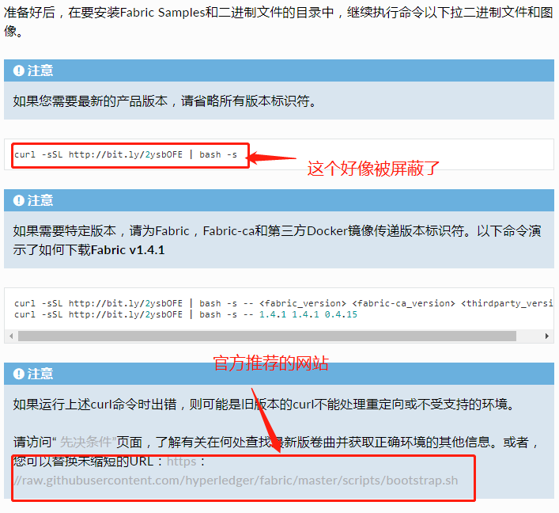
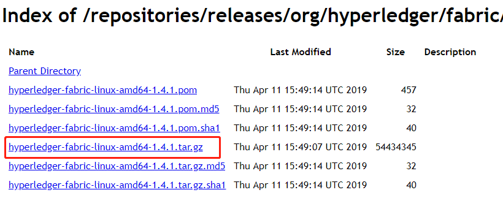

# hyperledger  fabric-samples 的下载安装

由官网给出的文档表明:
首先，要在计算机上要放置fabric-samples 存储库的位置，并在终端窗口中切换到改目录下。顺序执行以下命令：
```
1. 如果需要，克隆[hyperledger / fabric-samples](https://github.com/hyperledger/fabric-samples)存储库
2. 签出适当的版本标签
3. 将指定版本的Hyperledger Fabric平台特定二进制文件和配置文件安装到fabric-samples的/ bin和/ config目录中
4. 下载指定版本的Hyperledger Fabric docker镜像
```

### 1.克隆hyperledger  fabric-samples存储库

```
git clone https://github.com/hyperledger/fabric-samples.git
```

## 2. 版本（默认最新版本）

### 3-4.下载镜像和bin文件

#### 方法一（首选）：

我使用的如下命名，安装成功。大概需要等待10分钟左右

```
curl https://raw.githubusercontent.com/hyperledger/fabric/v1.0.5/scripts/bootstrap.sh | bash -s
```




官方提供了一个bootstrap.sh的脚本, 该脚本完成三个功能 , 1 ,fabric-samples文件下载 , 2 , 二进制文件下载 ,3 , docker镜像的拉取. 并且这个脚本支持三个参数, 可以灵活地控制它的执行 . 分别是

-b:加上此参数,则不下载二进制文件

-d:加上此参数则不拉取docker镜像

-s:加上此参数则不下载fabric-samples


完成，开始部署

----

#### 第二种方法：

访问网站：

```
https://nexus.hyperledger.org/content/repositories/releases/org/hyperledger/fabric/hyperledger-fabric/linux-amd64-1.4.1/
或者
ttps://nexus.hyperledger.org/content/repositories/releases/org/hyperledger/fabric/hyperledger-fabric/linux-amd64-1.4.1/hyperledger-fabric-linux-amd64-1.4.1.tar.gz
```

可以得到一个压缩包，这就是`/bin`文件的压缩包



##### 手动下载

接着，把

```
https://raw.githubusercontent.com/hyperledger/fabric/v1.0.5/scripts/bootstrap.sh 
```

脚本里的

```
echo "===> Downloading platform binaries"
curl https://nexus.hyperledger.org/content/repositories/releases/org/hyperledger/fabric/hyperledger-fabric/${ARCH}-${VERSION}/hyperledger-fabric-${ARCH}-${VERSION}.tar.gz | tar xz
```

代码注释掉

运行这个脚本，就可以下载镜像了。

---

##### 方法二，等于是手动下载安装，即，将方法一分成了两个步骤

在 `$GOPATH/src/github.com/hyperledger`目录下执行该脚本 ,如果没有此目录,创建即可 

> mkdir -p $GOPATH/src/github.com/hyperledger
>
> 中间会下载二进制文件到bin目录 ,此步骤执行的特别慢, 往往会断掉. 如果该脚本不能执行成功的, 后面会教你手动完成这三个任务 。

其实也可以不用执行这个脚本, 因为为二进制文件我们可以本地下载后上传至linux系统中, fabric-sample我们也可以手动下载,而docker镜像可以不用提前下载, 因为docker在用到某个镜像时,如果不存在,会自动下载 . 也就是说 ，我们手动完成前两步就可以了。

在不执行该脚本的情况下,我们的操作步骤应该是:(注意当前路径是hyperledger目录)

```
1 , 下载fabric-sample
git clone https://github.com/hyperledger/fabric-samples
2 ,下载二进制文件
然后下载二进制文件并解压 , 由于官方提供的文件下载速度慢, 我这里提供了一份压缩好的二进制文件 ,方便大家进行下载.
```

下载完之后解压会形成bin,和config目录, 此时列出当前目录应该有一下文件,而 bootstrap.sh文件可有可无.


然后执行如下命令,赋予bin目录下的文件可执行权限 ， 

chmod +x bin/*
如果你成功执行了bootstrap.sh脚本 , 直接进行下面的3即可

3,启动网络
将bin目录设置到系统环境变量中,并使之生效:

```
在/etc/profile中添加
export PATH=PATH:GOPATH/src/github.com/hyperledger/bin
然后执行
source profile
```

通过

```
peer version
```


命令来验证你的二进制文件,以及环境变量的配置是否成功，成功后的提示信息：


