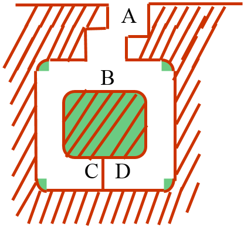

# FFS的零知识身份证明

### 1. 零知识证明的概述

现有：

- 示证者：P（prover）
- 验证者：V（verifier）

P 知道某个秘密；他想让 V 相信他知道该秘密。

最大泄露证明：完整地泄露该秘密。

最小泄露证明： P使用一种证明方法，让 V 相信他知道该秘密，但对该秘密的泄露程度最小。

##### 最小泄露证明满足下述条件：

1. P无法欺骗V。这就是说，若P真的知道该秘密，则使V确信P知道该秘密；若P不知道该秘密，则他不能使V相信他知道该秘密。
2. V无法欺骗P。这就是说，在验证/证明过程中，无论P怎样努力都不可能得到该秘密的更多信息。特别是， V不可能向其他人证明P知道该秘密。

##### 零知识证明定义： 

P使用一种证明方法，让V相信他知道该秘密，又能保证不泄露该秘密。即

1. P无法欺骗V。这就是说， P只有真的知道该秘密，才能使V相信他知道该秘密。
2. V无法欺骗P。这就是说，在验证/证明过程中，无论P怎样努力都只知道“P知道该秘密”，除此以外一无所获。特别是， V不可能向其他人证明P知道该秘密。

##### 注意：一般的公钥加解密不是零知识证明

设  P 公布公钥，他想让V相信他知道私钥

V随机地取一个明文m用公钥加密，将密文c 送给P。如果P能够将c正确解密，则V相信P知道私钥。

当V将一个明文m用公钥加密得到密文c 时，他实际上已经获得了私钥的一条知识：“私钥对c解密会得到m”。

当然这条知识不足为患，但绝对破坏了零知识证明的前提条件。

---

##### 关于零知识证明的若干说明

① 验证/证明过程不能由P决定，而应该由V决定。V提问（challenge），P回答（reply）。因此零知识证明是一个交互证明过程。

② 每一次V向P提问，若P知道秘密则可正确回答V的提问；若P不知道秘密，则对提问给出正确回答概率仅为1/2。V以足够多的提问就可推定P是否知道秘密。

③ 要保证这些提问及其相应的回答不会泄露秘密。

### 2. 零知识证明的基本协议

如图，设P知道咒语，可打开 C和 D之间的秘密门，不知道者 B都将走向死胡同中。

##### 协议：

​    (1) V站在洞口A点；

​    (2) P进入洞中任一点C或D；

​    (3) 当P进洞之后，V走到B点；

​    (4) V 叫P：(a)从左边出来，或(b)从右边出来；

​    (5) P按要求实现(以咒语，即解数学难题帮助)；

​    (6) P和V重复执行 (1)～(5)共n次。

若A不知咒语，则在B点，只有50 %的机会满足B的要求。协议执行n次，则只有2-n的机会完全满足，若n=16，则若每次均通过B的检验，B受骗机会仅为1/65536。

----

### 3. 实现零知识身份证明的密码体制

#### 简化F-F-S身份识别体制

##### 场景：

- 示证者P 可向 验证者V 证明他的确是 P。
- 在示证者P 向 验证者V 证明他的身份后，验证者V 并没有获得有用的信息，V不能模仿P向第三方证明他是P。

##### 协议实现：

可信赖仲裁选定一个随机模 $m=p_1×p_2$，m 为 512 bits或 1024 bits，一组证明者间可以共享此 m。

> 定义：当存在某个 X，式子$x^2 \equiv d (mod p)$ 成立时，称 “d是模p的二次剩余”；当对任意不成立时，称**“ d是模 p的二次非剩余”**

可信仲裁方可实施公钥私钥的分配。

为了产生P的公钥和私钥，他产生随机数 `y`（保证每个v是不可预测的且是不同的），计算 $y^{2}=v$，即  v为模m的平方剩余（也叫二次剩余），且计算$v^{-1} mod m$。以 m 和 v作为 P 的公钥，而后计算满足下式的最小的正整数 s（一定能计算出！），将 s 作为 P 的私钥分发给 P。即，
$$
s= \sqrt{\frac {1}{v}}(mod m)  \\
(其实，是计算方程\ s^2=v^{-1} (mod\ m) 的最小解.\ 由于不知道m的分解式 m=p_1p_2,所以其他人无法计算出s)
$$
- P的公钥是 m 和 v
- P的私钥是 `s`

实施身份证明的协议如下：

1. P 取随机数 r ( r<m)，计算 $x \equiv r^2 modm$，将 x 送给 V
2. V 将一随机比特 b送给P
3. 若 b=0，则 P将 r 送给 V；若b=1，则 P 将 $u \equiv rs (modm)$ 送给V
4. 若 b=0，则 V证实 $x= r^2 mod(m)$；若b=1，则V证实 $x=u^2 ·v (modm)$

P 和 V可将此协议重复 t 次，直到 B相信 A知道 `s`为止

##### 安全性（一）： P骗V的可能性

注意到动作顺序是：

1. P将x送给V
2. V将随机比特b送给P
3. P根据b=0或b=1将r或u送给V

设P不知道私钥是 `s`，则他事先设计 (x, r) 的方法只能是：先选 r，后计算
$$
x \equiv r^2 (modm)
$$
他事先设计 (x, u) 的方法只能是：先选u，后计算
$$
x \equiv u^{2}v (modm)
$$
在 P将值 $x$ 发给 V 后，V 要求查看 $r$ 或 $u$ 中的一个，但是由于他没有私钥 $s$ ，所以他不可能事先都设计出  $(x, r , u)$ 同时满足一下两式：
$$
x \equiv r^2 (modm)  和 x \equiv u^{2}v (modm)\\其中，u \equiv rs (modm)
$$
因此他在协议中骗 V成功的概率为 1/2。将此协议重复 $t$ 次， P 骗 V全部成功的概率为 $\frac {1}{2^t}$

##### 安全性（二）： V骗P的可能性

设 V 骗 P以获取 `s` 的信息。注意到在协议中 V 的获得：

- 当 b=0时： V 获得 (x, r)满足 $x \equiv r^2 (modm)$ ；

- 当b=1时： V 获得 (x, u)满足 $x \equiv u^{2}v (modm)$ 。

其中，$v$是公开的。(x, r)或(x, u)除了满足各自的方程以外，不含有s的任何信息。

因此，在协议中V完全得不到关于 `s` 的任何信息。换句话说，该协议是一个零知识协议

##### 为何如此设计

- 如果协议的第（1）步不是P的动作，而是V的动作，则协议是不安全的。为什么？

因为这样，p可以提前计算好 r 或 u，并且每次都是正确的。这样V发随机比特b就变得毫无意义。

- 如果协议的第（2）步不是V的动作，而是P的动作，则协议是不安全的。为什么？

这样的话，P就可以欺骗V了。

- 如果在协议的第（3）步，无论b为何值，P都将 r 和 u=rs 一并送给V，则协议是不安全的。为什么？

这样的话，V就得到了两个公式，可以解除 `s`了

- 限制 s 为“四个平方根中的最小值”，有什么好处？
- 如果 s 不是 v 的逆元的平方根，而直接是 v 的平方根，则安全性并没有任何降低。为什么？

---

#### 非交互零知识身份证明：Fiat-Shamir证据

##### 前提：

- 公钥（m, v）和 私钥s 和FFS协议相同
- 多取一个公开的杂凑函数 h

##### 协议实现：

(1) P 取 $t$ 个随机数 $r_i (i \in [1,t],其中，t<m)$,计算并公布 $t$ 个模平方数

$$
x_i=r_i^2 (modm)，i \in [1,t]
$$
(2) P计算 $h(x_1, x_2, ......, x_t)$，并公布 $t$个比特

$$
b_i，i \in [1,t]
$$
 其中 $b_i$是 $h(x_1, x_2, ......, x_t)$ 的第 $i$ 比特。

(3) P 根据 $b_i$ 的值公布 $u_i$：

- 若 $b_i=0$，则 $u_i=r_i$；

- 若$b_i=1$，则 $u_i=r_is (modm)$。

被公布的数据 $\{{x_i, b_i, u_i, i \in [1,t]}\}$ 就称为Fiat-Shamir证据

##### 验证

若$b_i=0$，则 V 证实 $x_i=u_i^2 (modm)$；

若$b_i=1$，则 V 证实 $x_i=u_i^2·v (modm)$。

##### 安全性

若不知道私钥s，则伪造的顺序陷入两难：

##### 新颖性

用杂凑函数（随机预言机）替代随机提问（挑战）。

 