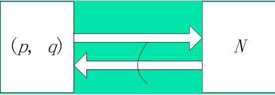
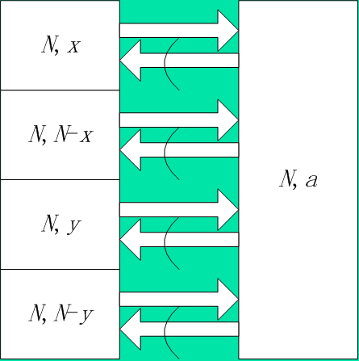
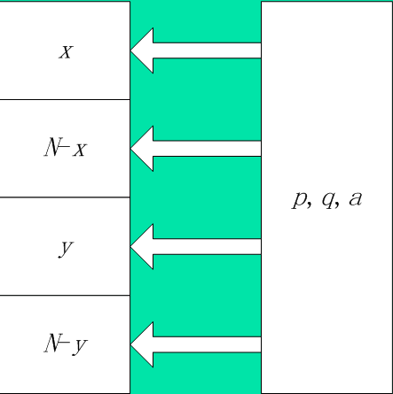
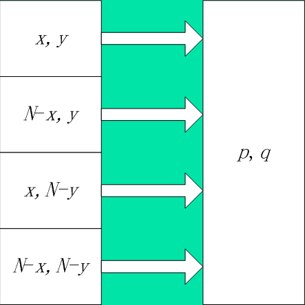
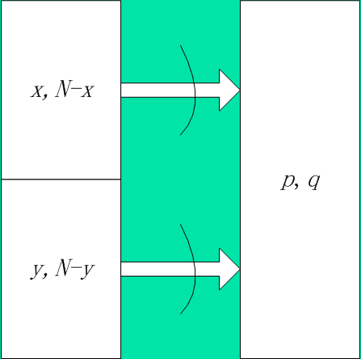

# 不经意传输

### 不经意传输协议：Oblivious Transfer（OT）

---

场景：

设Alice欲告诉Bob 某个秘密。 Alice使用一个“不经意传输协议”将此秘密发送给Bob。则发送/接收过程就具有以下的性质：

1. Bob能够获得此秘密的概率是1/2。

换句话说，Bob不能获得此秘密的概率也是1/2 。

再换句话说，无论Alice或Bob怎样努力，只要Alice和Bob使用的是不经意传输协议，则Bob成功地获得秘密的概率就只能是1/2。即，Alice或Bob都无法影响秘密的成功接收。影响秘密的成功接收的因素只有一个，那就是概率分布。在 发/收 过程实际上就是一个动作：高抛硬币，落地后正面朝上和反面朝上的概率各占1/2，任何人也无法干预落地后的结果。

2. 发送/接收过程完结时， Alice无法确知Bob是否得到了秘密。

换句话说，在发/收过程结束后， Alice仍然仅仅知道： Bob得到秘密和未得到秘密的可能性各占1/2。

除此之外， Alice得不到任何新的消息。

---

### 不经意传输的应用实例

设Alice欲向Bob 行贿。 

Bob不愿让Alice知道自己是否接受了贿赂。而Alice也愿意让Bob放心，只关心自己行贿，不愿知道对方是否受贿。

于是他们使用一个“不经意传输协议”传输贿金帐号。这样，即使发现Alice行贿，也无法证明Bob受贿。

---

### Rabin的“不经意传输协议”

####  预备知识：计算数论的一些结果

设有两个大素数p和q

令
$$
N=p \cdot q
$$
取整数`x`，其中`1<x<N`

令
$$
a=x^{2}(mod N)
$$

##### 结果一  

已知N，求p和q困难。（大数分解）

##### 结果二  

由 $a$ 推导出的解 $x$ 一共有4个`(modN)`，他们是：
$$
x^{2} \equiv a (mod N) \\
的解有四个，即,\{x  ; N-x ; y ; N-y\}
$$
即：
$$
a \equiv x^{2} \equiv (N-x)^{2} \equiv (N-y)^{2} \equiv y^{2} (mod N)
$$
且`x、N-x、y、N-y`互不相等。 4个`(modN)`平方根的关系如下：
$$
设 x \equiv u(mod p ),x \equiv v (modq) \\
则 N-x \equiv p-u (mod p),N-x \equiv q-v (mod q) \\
y \equiv u(modp),y \equiv q-v (mod q)\\
N-y \equiv p-u (mod p),N-y \equiv v(mod q)
$$

##### 结果三  

- 如果已知`{p，q，a}`，则可以求出 a 的4个 (modN) 平方根 `{x，N-x，y，N-y}`  。
- 如果仅仅已知`{N，a}`，则不能求出 a 的任何一个 (modN) 平方根。

##### 结果四

- 如果已知 `{N，x，y}` 或已知 `{N，x，N-y} `或已知 `{N，N-x，y}` 或已知 `{N，N-x，N-y}`，则可以求出 p 和 q 
- 如果仅仅已知 `{N，x，N-x} `或仅仅已知 `{N， y，N-y}`，则不能求出 p 和 q

#### 图例

##### 结果一

##### 结果二

##### 结果三

##### 结果四

---

### Rabin的不经意传输协议

1. Alice 取定两个大素数p和q， `{p，q}`就是Alice要发送给Bob的秘密
2. Alice 计算 $N=pq$，并将 N 发送给 Bob
3. Bob 取定整数 x，1<x<N，计算 $x^{2}(modN)$，令其等于$a$，并将 $a$ 值发送给 Alice 。
4. Alice 根据结果三， Alice解方程  $x^{2}  \equiv a (mod n)$ ,计算$a$的4个 `(modN)`平方根`{x，N-x，y，N-y}` 
5. Alice 在4个平方根 `{x，N-x，y，N-y}`中随机地选择一个，并将它发送给 Bob
6.  Bob 收到了 Alice发送的一个“平方根” z。 

Bob首先检查是否
$$
z^{2}(modN)=a
$$
**若是，则 z 是$a$的 (modN) 平方根** ， 否则说明Alice作弊。

再根据结果四，有：

- 如果 $z=x$，则 Bob不能求出 p和 q
- 如果 $z=N-x$，则 Bob不能求出 p和q
- 如果 $z≠x，z≠N-x$，则 Bob可以求出 p和q

##### 分析：

由于Alice只知道值 $a$ ，并不知道 $x$ .换句话说，Alice并不知道 Bob 在 $x^{2}(modN)$ 的4个平方根`{x，N-x，y，N-y}`中到底选择了哪一个。因此 Alice 只好随机地选择一个，并将它发送给 Bob。

Alice 选择 x或 N-x的概率为1/2，他选择 y或 N-y的概率也为1/2。

Bob 在第6步的时候，检查收到的数 $z$ 是否与 $\pm x$ 在模 $n$ 下同余。如果是的话，则 Bob 并没有收到新的消息，也解不开秘密 `{p，q}`;如果不是的话，则Bob 就知道了  $x^{2}(modN)$ 的4个不同的平方根，从而可以分解大数 $n$。

因此Bob获得秘密`{p，q}`和未获得秘密`{p，q}`的概率各占1/2。

---

在现实中，一般使用大素数进行RSA加密，知道了 p和q后，就相当于知道了秘钥，就可以解秘密了。