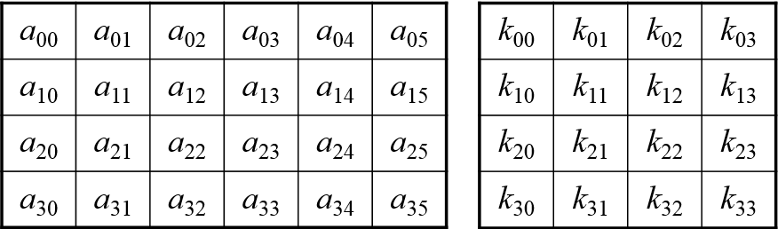
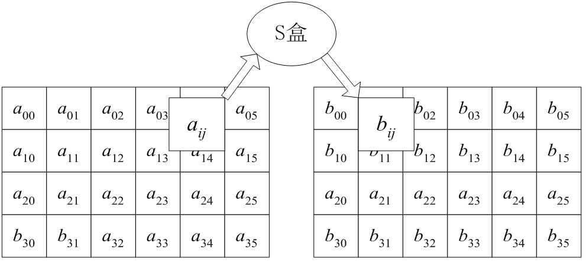
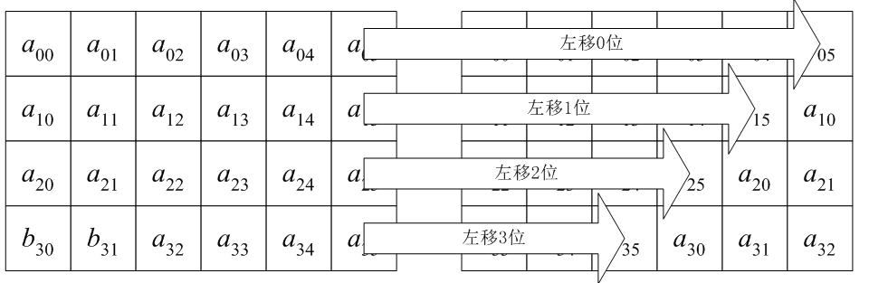
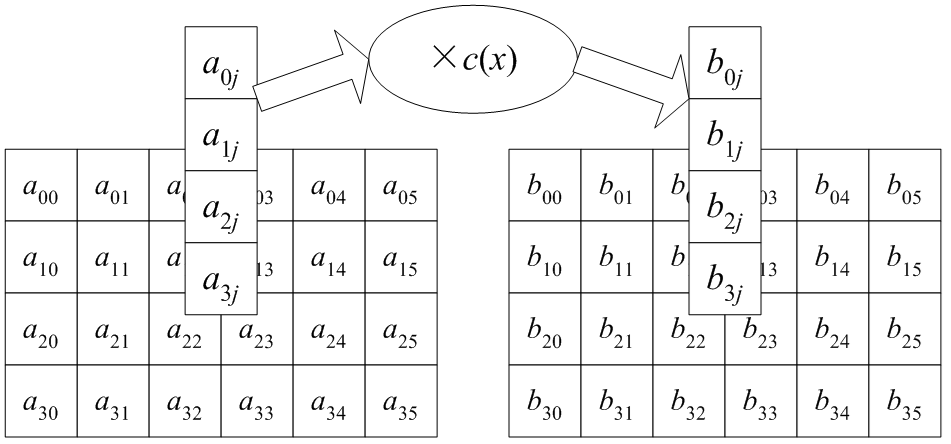
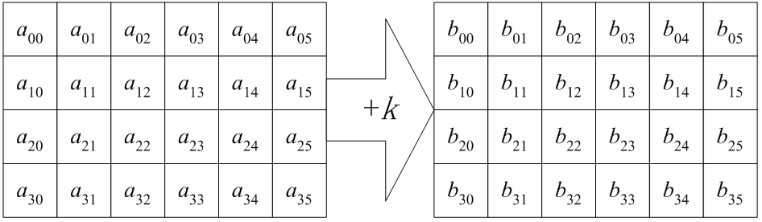

# 分组密码Rijndael

### 1.AES竞争过程及RIJNDAEL概述

鉴于DES的没落，美国政界和商界一直在寻求高强度、高效率的替代算法。

1997年，美国国家标准技术研究所（`NIST`）为了履行其法定职责，发起了一场推选用于保护敏感的（无密级的）联邦信息的对称密钥加密算法的活动。于是密码学界的精英们纷纷加入竞争的行列，提交自己设计的分组密码算法。与此同时，`NIST`制定了用于比较候选算法的评估准则。该评估准则分为三大项：（1）安全性；（2）成本；（3）算法和实现特性。

1998年，`NIST`宣布接受15个候选算法并提请全世界密码学界协助分析这些候选算法。分析的内容包括对每个算法的安全性和效率进行初步检验。 

`NIST`通过对这些初步研究结果的考察，于1999年8月20日选定了`MARS、RC6、RIJNDAEL、Serpent、Twofish`等5个算法作为参加决赛的算法。 经公众对决赛算法进行更进一步的分析评论，`NIST`决定推荐`RIJNDAEL`作为高级加密标准（`AES`）。

2000年10月2日，美国商业部长`Norman Y. Mineta`宣布，`RIJNDAEL`数据加密算法”最终获胜，同时为此而在全球范围内角逐了3年的激烈竞争随即结束。

`RIJNDAEL`的设计者是比利时密码学专家`Joan Daemen`和`Vincent Rijmen`。可以看出算法名称是两个人姓名的组合。他们的杰出的密码天才使他们脱颖而出。 

---

### 2. `RIJNDAEL`的数学基础

- 有限域$GF(2^8)$

- 系数在$GF(2^8)$上的多项式 


##### 定理  

$$
系数在GF(2^{8})上的多项式

b_3x^{3}+b_2x^{2}+b_1x+b_0

是模(x^{4}+1)可逆的，当且仅当以下矩阵在GF(2^{8})上可逆。
$$


$$
\begin{pmatrix} 
b_0 & b_3 & b_2 & b_1 \\ 
b_1 & b_0 & b_3 & b_2 \\ 
b_2 & b_1 & b_0 & b_3 \\
b_3 & b_2 & b_1 & b_0 \\
\end{pmatrix}
$$

### 3.算法说明

RIJNDAEL的明文分组称为状态(state)，所有的操作都在状态之间进行。

##### 加密

状态可以用以字节为元素的矩阵阵列图表示，该阵列有4行，列数记为$N_b​$，$N_b​$等于分组长度除以32。

##### 密钥种子

密钥种子（在原文中称为密码密钥Cipher Key）类似地用一个以字节为元素的矩阵阵列图表示，该阵列有4行，列数记为$N_k$，$N_k$等于分组长度除以32。

下图就是 $N_b=6$ 的状态和 $N_k=4$ 的密钥种子。一个明文分组按  $a_{00}a_{10}a_{20}a_{30}a_{01}a_{11}a_{21}a_{31}…$ 的顺序影射到状态阵列中。同理，密钥种子按 $k_{00}k_{10}k_{20}k_{30}k_{01}k_{11}k_{21}k_{31}…$ 的顺序影射到密钥种子阵列中。



---

### 4. 轮函数

RIJNDAEL加密，每一轮加密由四个不同的阶段组成，包括一个置换和三个代替，一般是10轮加密。由四个不同的计算部件所组成的轮函数，分别是：

- 字节代替（ByteSub）：用一个S盒完成分组的字节到字节的代替。
- 行移位（ShiftRow）：一个简单的置换。
- 列混淆（MixColumn）：利用域 $GF(2^8)$ 上的算术特性的一个代替。 
- 加密钥（AddRoundKey） ：当前分组和扩展秘钥的一部分进行按位XOR

#### 1. 字节代替（ByteSub）

正向和逆向变换。其实就是一个S盒的查表操作，其S盒的构造方式是将状态阵列的每个字节做相同的变换，该变换由以下两个子变换所合成：

（1）首先，将字节看作$GF(2^{8})$上的元素，映射到自己的乘法逆；0字节影射到它自身。 

（2）其次，将字节看作$GF(2)$上的8维向量，做如下的（$GF(2)$上的；可逆的）仿射变换： 
$$
\begin{pmatrix} 
y_0\\ y_1\\y_2\\y_3\\y_4\\y_5\\y_6\\y_7
\end{pmatrix}
=
\begin{pmatrix} 
1 & 0 & 0 & 0 & 1 & 1 & 1 & 1\\ 
1 & 1 & 0 & 0 & 0 & 1 & 1 & 1\\ 
1 & 1 & 1 & 0 & 0 & 0 & 1 & 1\\
1 & 1 & 1 & 1 & 0 & 0 & 0 & 1\\
1 & 1 & 1 & 1 & 1 & 0 & 0 & 0\\
0 & 1 & 1 & 1 & 1 & 1 & 0 & 0\\
0 & 0 & 1 & 1 & 1 & 1 & 1 & 0\\
0 & 0 & 0 & 1 & 1 & 1 & 1 & 1\\
\end{pmatrix}

\begin{pmatrix} 
x_0\\ x_1\\x_2\\x_3\\x_4\\x_5\\x_6\\x_7
\end{pmatrix}
+
\begin{pmatrix} 
1\\1\\0\\0\\0\\1\\1\\0
\end{pmatrix}
$$
以上两个子变换所合成的字节代替采用一个8比特输入/8比特输出的S盒来实现。

##### 例子

我们考虑输入值为 $\{95\}$ 的情况，在 $GF(2^{8})$中 $\{95\}^{-1}$的乘法逆为 $\{8A\}$，用二进制表示就是 $10001010$，使用上式，就是 
$$
\begin{pmatrix} 
1 & 0 & 0 & 0 & 1 & 1 & 1 & 1\\ 
1 & 1 & 0 & 0 & 0 & 1 & 1 & 1\\ 
1 & 1 & 1 & 0 & 0 & 0 & 1 & 1\\
1 & 1 & 1 & 1 & 0 & 0 & 0 & 1\\
1 & 1 & 1 & 1 & 1 & 0 & 0 & 0\\
0 & 1 & 1 & 1 & 1 & 1 & 0 & 0\\
0 & 0 & 1 & 1 & 1 & 1 & 1 & 0\\
0 & 0 & 0 & 1 & 1 & 1 & 1 & 1\\
\end{pmatrix}

\begin{pmatrix} 
0\\1\\0\\1\\0\\0\\0\\1
\end{pmatrix}

\bigoplus

\begin{pmatrix} 
1\\1\\0\\0\\0\\1\\1\\0
\end{pmatrix}

=

\begin{pmatrix} 
0\\1\\0\\1\\0\\1\\0\\0
\end{pmatrix}

={2A}
$$

#### 2. 行移位（ShiftRow）

是将状态阵列的各行进行循环移位，不同状态行的位移量不同。第0行不移动，第一行循环左移$C_1$个字节，第二行循环左移$C_2$个字节，第三行循环左移$C_3$个字节。位移量($C_1,C_2,C_3$)的选取与$N_b$有关，当$N_b=4$ 或 6 时一般取  ($C_1,C_2,C_3$)=(1,2, 3)

#### 3.列混合（MixColumn）

列混淆变换的正向列混淆变换对每列独立的操作，每列中的每个字节别映射为一个新值。做法是将状态阵列的每个列视为系数在$GF(2^{8})$上、次数小于4的多项式，被同一个固定的多项式c(x)进行模$x^4+1$乘法。

当然要求c(x)是模$x^4+1$可逆的多项式，否则列混合变换就是不可逆的，因而会使不同的明文分组具有相同的对应密文分组。

RIJNDAEL的设计者所给出的c(x)为（系数用16进制数表示）：
$$
c(x)='03'x^{3}+'01'x^{2}+'01'x+'02'
$$
c(x)是与$x^4+1$互素的，因此是模$x^4+1$可逆的。

由前面的讨论知，将状态阵列的每个列视为$GF(2^{8})$上的4维向量，列混合运算可表示为$GF(2^{8})$上的可逆线性变换
$$
\begin{pmatrix} 
b_0\\b_1\\b_2\\b_3
\end{pmatrix}
=
\begin{pmatrix} 
02 & 03 & 01 & 01 \\ 
01 & 02 & 03 & 01 \\ 
01 & 01 & 02 & 03 \\
03 & 01 & 01 & 02 \\
\end{pmatrix}

\begin{pmatrix} 
a_0\\ a_1\\a_2\\a_3
\end{pmatrix}
$$
这个运算需要做$GF(2^{8})$上的乘法。但由于所乘的因子是三个固定的元素02、03、01，所以这些乘法运算仍然是比较简单的

（注意到乘法运算所使用的模多项式为$m(x)= x^{8}+x^{4}+x^{3}+x+1$）

设一个字节为$b=(b_7b_6b_5b_4b_3b_2b_1b_0)$，则
$$
\begin{align*}
b× '01'& =b  \\

b×'02'&=(b_7b_6b_5b_4b_3b_2b_1b_0)+(000b_7b_70b_7b_7) \\

b×'03'&=b×'01’+b×’02’
\end{align*}
$$
（请注意，加法为取模2的加法，即逐比特异或）

##### 基本原理，即为什么选这样的矩阵

1. 矩阵系数是基于码字间有最大距离的线性编码，这使得在每列的所有字节中有良好的混淆性。
2. 简洁性，在算法实现上容易实现。

设计者选择的列混合部件是安全性与简洁性的最优兼顾。

#### 4.加密钥（AddRoundKey）

是将单轮 子密钥阵列简单地与课文阵列进行比特异或。

这里当然要求 子密钥阵列 与 课文阵列 是同阶的。 

---

综上所述，组成RIJNDAEL轮函数的计算部件简洁快速，功能互补。轮函数的伪C代码如下：

```
Round (State, RoundKey)
{
    ByteSub (State)
    ShiftRow (State)
    MixColumn (State)
    AddRoundKey (State, RoundKey)
}  
```

---

##### 结尾轮

结尾轮是特殊轮，轮函数与前面各轮不同，将MixColumn这一步去掉。即为

```
FinalRound (State, RoundKey)
{
   ByteSub (State)
   ShiftRow (State)
   AddRoundKey (State, RoundKey)
} 
```

在以上的伪C代码记法中， `Round、FinalRound、ByteSub、ShiftRow、MixColumn、AddRoundKey `等函数都在指针`State、RounKey`所指向的阵列上进行运算。 

### 5.图文展示

##### 字节替代



##### 行移位



##### 列混合



##### 加密钥



### 6.迭代次数

迭代的轮数记为 $N_r$，$N_r$与 $N_b$和 $N_k$ 有关，其中 $N_b$是明文阵列的列数， $N_k$ 是密钥种子阵列的列数。

下表给出了 $N_r$与 $N_b$ 和 $N_k$ 的关系：

| $N_r$     | $N_b = 4$ | $N_b=6$ | $N_b=8$ |
| --------- | --------- | ------- | ------- |
| $N_k=4$   | 10        | 12      | 14      |
| $N_k = 6$ | 12        | 12      | 14      |
| $N_k=8$   | 14        | 14      | 14      |

---

### 7. `RIJNDAEL`的解密算法

`RIJNDAEL`不是加解密相似的。

`RIJNDAEL`密码的设计显然忽视了解密算法的性能。

其中的原因有两个：

> 一是解密算法性能的重要性远不如加密算法性能；在分组密码的许多应用中，解密算法是不使用的，比如消息认证码（MAC）、消息加密的CFB模式或OFB模式等。
>
> 二是忽视解密算法性能会使加密算法的性能设计更加容易。 

